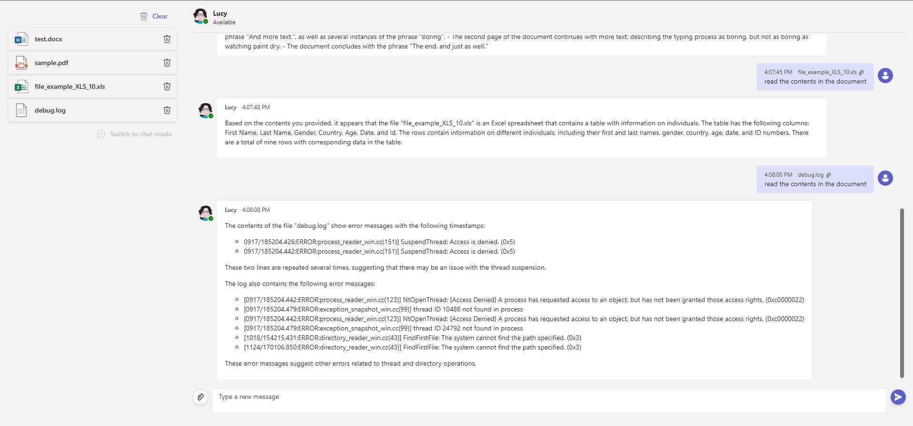

# Lucy

This repository contains the code for Lucy, a chatbot application developed using `React` for the frontend and `Python` for the backend. The chatbot is powered by `OpenAI`, which provides natural language processing capabilities.

## Features

* Real-time chat interface
* OpenAI integration for natural language processing
* Upload your PDF files and ask questions about the file

### Installation

To run the Lucy chatbot application locally, follow these steps:

### Prerequisites

* Node.js and npm: Install Node.js and npm (Node Package Manager) by visiting the official website and downloading the installer for your operating system.
* Python: Install Python by visiting the official website and downloading the installer for your operating system.

### Frontend Setup

1. Clone the repository: `https://github.com/ranjithsnair/lucy.git`
2. Navigate to the frontend directory: `cd .\lucy\client\`
3. Install dependencies: `npm install`
4. Start the development server: `npm start`
5. Access the application at `http://localhost:3000`

### Backend Setup

1. Navigate to the backend directory: `cd .\lucy\server\`
2. Create a virtual environment (optional but recommended): `python -m venv venv`
3. Activate the virtual environment (if created):
on `Windows`: `venv\Scripts\activate`
on `macOS` and `Linux`: `source venv/bin/activate`
4. Install dependencies: `pip install -r requirements.txt`
5. Start the backend server: `python main.py`
6. The backend server should now be running at `http://localhost:8000`

## Configuration

### Backend Configuration

To configure the backend of the application, set below environment variables.

* `OPENAI_API_URL`
* `OPENAI_API_KEY`

## Contributing

Contributions are welcome! If you find any issues or have suggestions for improvement, please open an issue or submit a pull request.

## License

This project is licensed under the [GPL License](./LICENSE).